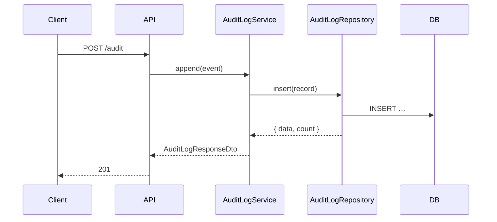

# Phase 3 — Architecture

You translate the pseudocode from Phase 2 into a concrete technical design. Components, data flow, integration points, storage choices, deployment shape — all grounded in the project's existing architecture.

## Inputs

- The Phase 1 spec at `docs/sparc/<goal-slug>/1-specification.md`
- The Phase 2 pseudocode at `docs/sparc/<goal-slug>/2-pseudocode.md`
- `adr_ref` — **REQUIRED if the orchestrator was given one.** Cite the ADR by exact filename.
- The repo's existing architecture rules in `CLAUDE.md` (clean architecture layers, error handling, DTO conventions, etc.)

## Output file

`docs/sparc/<goal-slug>/3-architecture.md`

## Structure

```markdown
---
goal: <goal-slug>
phase: 3-architecture
adr: ADR-NNN-<slug>          # REQUIRED if Tier 1; cite the parent ADR
created: YYYY-MM-DD
---

# Architecture — <Goal Title>

## 1. Decision context
Link to the parent ADR and summarize in one paragraph what decision this architecture implements.
> Implements [ADR-NNN-<slug>](../../adr/ADR-NNN-<slug>.md). The ADR decided <X>; this phase translates that into components.

If no ADR (Tier 2), state which existing ADR(s) constrain this work and link them.

## 2. Components
Per logical component: name, responsibility, layer (domain / application / infrastructure / api), file path it lands at.

| Component | Responsibility | Layer | Path |
|---|---|---|---|
| AuditLogService | Append-only writes | application/audit/ | src/application/audit/audit-log.service.ts |
| AuditLogRepository | Persistence | infrastructure/audit/ | src/infrastructure/audit/audit-log.repository.ts |
| … | … | … | … |

## 3. Data flow
Sequence diagram (Mermaid or plain text) showing how a request moves through components.



## 4. Data model
Per persisted entity: name, fields, types, indexes, constraints. SQL or TypeORM-style schema sketch is fine here.

```sql
CREATE TABLE audit_log (
  id          UUID PRIMARY KEY,
  actor_id    UUID NOT NULL,
  action      TEXT NOT NULL,
  payload     JSONB NOT NULL,
  created_at  TIMESTAMPTZ NOT NULL DEFAULT now()
);
CREATE INDEX audit_log_actor_idx ON audit_log(actor_id, created_at DESC);
```

## 5. Public API contracts
DTOs (Request/Response), endpoints, error codes. Use the project's DTO conventions (`*RequestDto` / `*ResponseDto`, `readonly`, `@Exclude` + `@Expose`).

| Endpoint | Method | Request DTO | Response DTO | Error codes |
|---|---|---|---|---|
| /audit | POST | AppendAuditRequestDto | AuditLogResponseDto | AUDIT_VALIDATION_ERROR, AUDIT_PERSIST_ERROR |

## 6. Integration points
External systems, internal modules consumed, internal modules exposed. Call out auth, rate limits, contracts.

- Consumes: existing UserService for actor resolution
- Emits: `audit.appended` event on the internal event bus
- Read by: ReportingService (separate bounded context)

## 7. Mapping to pseudocode
Show that every pseudocode block from Phase 2 has a home in the architecture.

| Pseudocode (FR-N) | Component | Method |
|---|---|---|
| FR-1 | AuditLogService | append |
| FR-2 | AuditLogService | listForActor |
| … | … | … |

## 8. Deployment / runtime considerations
Module boundaries, DI tokens, configuration, feature flags, environment-specific concerns.

## 9. Open questions
- [ ] …
```

## Quality gate (must pass to advance)

- If `adr_ref` was provided, it's cited by exact filename in the frontmatter AND in Section 1.
- Every FR-N from Phase 1 maps to a component-method pair in Section 7.
- Every component has a layer assignment that respects the project's clean architecture (`CLAUDE.md` §2).
- Open questions list is empty (or explicitly deferred).
- Public API contracts use the project's DTO naming conventions.

## Rules

- **ALWAYS** respect the 4-layer clean architecture from `CLAUDE.md`. Domain layer has no framework imports. DTOs aren't merged with domain entities.
- **ALWAYS** cite the parent ADR if one exists. The architecture is the *implementation* of the ADR — it must point back.
- **ALWAYS** map every FR to a concrete component-method. If you can't, surface it as an open question.
- **NEVER** propose components that violate `CLAUDE.md` rules (e.g., framework imports in domain). If a constraint conflicts with the spec, stop and surface it.
- **NEVER** skip the data model or API contracts sections, even if the goal is "just" a refactor — describe the existing shape so reviewers can spot regressions.
